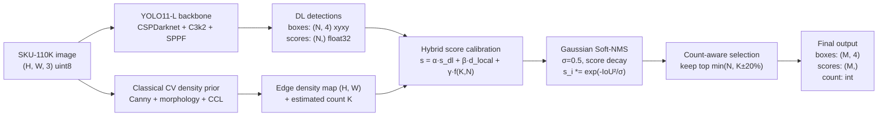

# Phase 3 Model Selection

## Project Understanding

The task is dense retail item detection/counting on SKU-110K. The hard part is not recognizing one product category; SKU-110K is effectively a single-class dense object detection benchmark where many similar boxes overlap on shelves. The Phase 3 rubric rewards a coupled hybrid system, same-split ablations, a clear architecture diagram, and turn-key reproducibility.

## Source-Backed Choice

- The official SKU-110K release describes dense scenes with many similar objects in close proximity and provides the dataset for academic, non-commercial use.
- Ultralytics YOLO11 is the most practical current training choice for this repo: it supports detection training/validation/export directly, has pretrained checkpoints, and YOLO11m is documented as improving mAP with fewer parameters than YOLOv8m.
- DenseDet/EM-Merger is a strong SKU-specific research reference, but its public implementation is tied to older MMDetection/MMCV versions. For a reproducible student project, YOLO11 fine-tuning plus a density-aware Soft-NMS hybrid gives a better chance of running cleanly.

## Implemented Architecture



The coupling is intentional: the classical branch does not merely run beside the neural model. It changes neural scores using local edge-density support and count consistency, then affects which detections survive Soft-NMS.

## Required Ablations

Run:

```bash
python -m src.models.hybrid_sku_detector --weights runs/phase3/yolo11_sku110k/weights/best.pt --mode all --limit 200
```

This writes `reports/phase3_ablation_results.csv` with:

- `ml_only`: classical density prior boxes only.
- `dl_only`: raw YOLO predictions.
- `dl_soft_nms`: YOLO predictions with Gaussian Soft-NMS.
- `hybrid`: YOLO plus density/count calibration plus Soft-NMS.

## Sources

- Official SKU-110K repository: https://github.com/eg4000/SKU110K_CVPR19
- Ultralytics YOLO11 docs: https://docs.ultralytics.com/models/yolo11/
- SKU-110K dataset metadata mirror: https://huggingface.co/datasets/Voxel51/sku110k_test
- DenseDet SKU-110K reference implementation: https://github.com/Media-Smart/SKU110K-DenseDet
